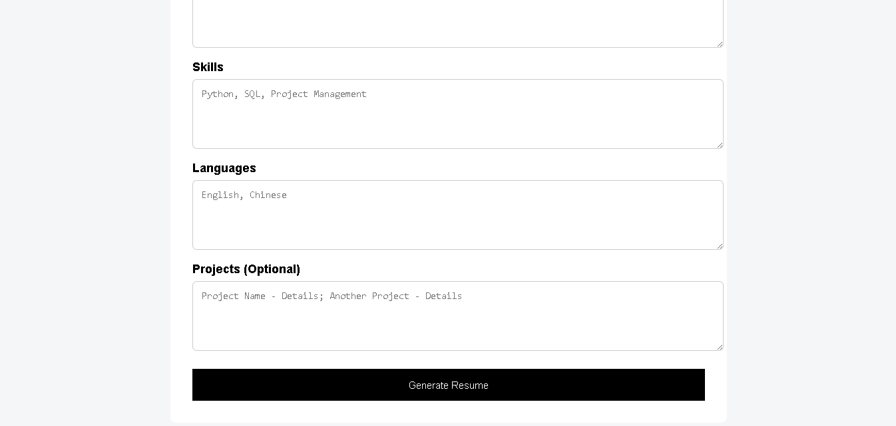
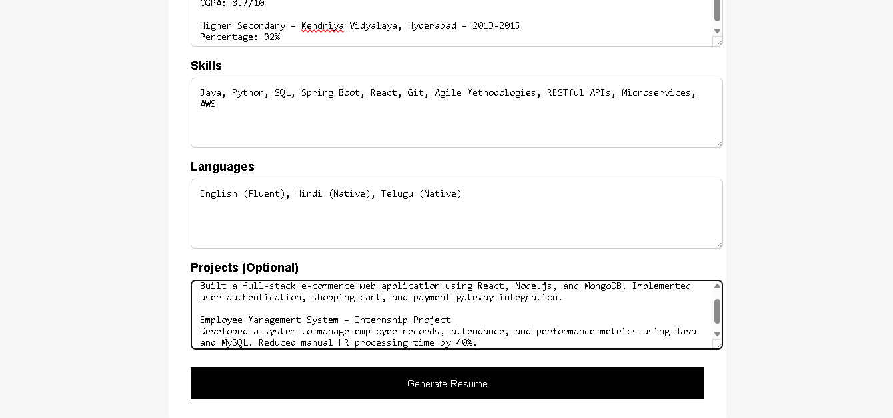
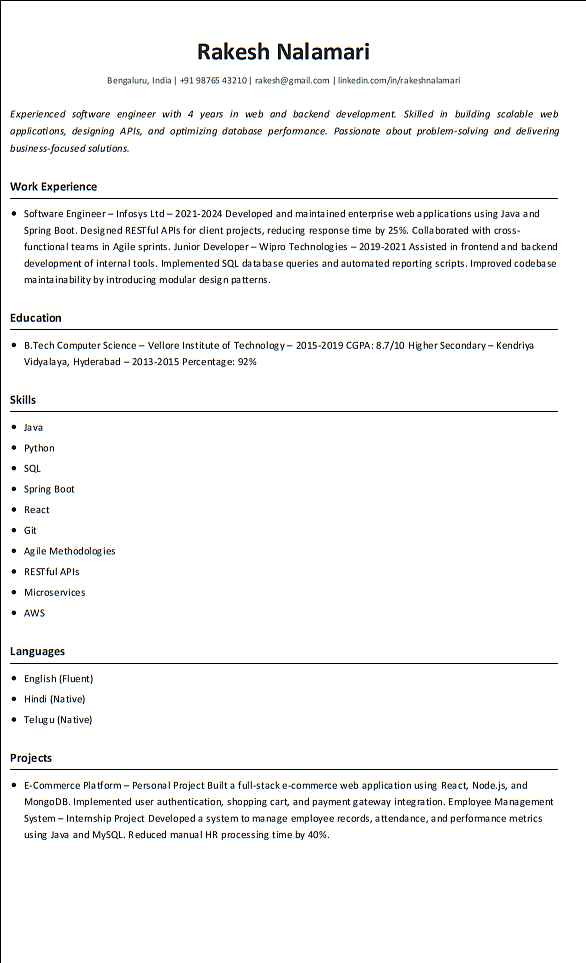

# 📄 Professional Resume Builder

A simple and professional **Resume Builder web application** that allows users to enter real-world resume details and instantly generate a clean, formatted resume.

This project simulates a real-world resume creation workflow and is a great project for students, job seekers, and developers learning Flask.

---

## 🚀 Features

- Easy-to-use input form  
- Collects real-world resume information  
- Generates a structured professional resume  
- Clean and minimal UI  
- PDF-ready resume output  
- Beginner-friendly Flask project  

---

## 🛠️ Tech Stack

- Frontend: HTML, CSS  
- Backend: Python (Flask)  
- Templating: Jinja2  
- PDF Generation: pdfkit + wkhtmltopdf  

---

## 📸 Screenshots

### Input Page

### Filling Resume Details

### Successfully Generated

### Generated Resume

---

## ⚙️ How It Works

1. User enters details in the form  
2. Data is sent to Flask backend  
3. Backend formats the resume using templates  
4. Resume is displayed or exported as PDF  

---

---

## 📌 Use Cases

- Students creating resumes  
- Placement preparation  
- Flask learning project  
- Developer portfolio project  

---

## 🔮 Future Improvements

- Multiple resume templates  
- One-click PDF download  
- Profile photo support  
- Drag-and-drop sections  
- Cloud storage saving  

---

## 👨‍💻 Author

Rakesh Nalamari  
Aspiring Backend Developer | Creative Thinker | Artist

---

## ⭐ Support

If you like this project:

- Star the repo  
- Fork and improve it  
- Share with others  
